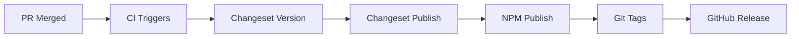

# Contributing to Singularity Payments

Thank you for your interest in contributing to Singularity Payments! This guide will help you get started with contributing to our monorepo.

## Table of Contents

- [Getting Started](#getting-started)
- [Development Workflow](#development-workflow)
- [Project Structure](#project-structure)
- [Making Changes](#making-changes)
- [Submitting a Pull Request](#submitting-a-pull-request)
- [Changesets](#changesets)
- [Code Quality](#code-quality)
- [Release Process](#release-process)

## Getting Started

### Prerequisites

- **Node.js** 20 or higher
- **pnpm** 10.25.0 (automatically enforced by packageManager field)
- **Git**

### Initial Setup

1. **Fork and Clone**
   ```bash
   git clone https://github.com/singularityke/singularity-payments-js.git
   cd singularity-payments
   ```

2. **Install Dependencies**
   ```bash
   pnpm install
   ```

3. **Build All Packages**
   ```bash
   pnpm build
   ```


## Development Workflow

### Available Commands

From the root directory, you can run:

```bash
# Build all packages (uses Turborepo for caching)
pnpm build


# Lint code across all packages
pnpm lint

# Run TypeScript type checking
pnpm typecheck

# Create a changeset (required for most PRs)
pnpm changeset

# Version packages (done automatically by CI)
pnpm version

# Release packages (done automatically by CI)
pnpm release
```

### Working on a Specific Package

```bash
# Navigate to the package
cd packages/express

# Run package-specific commands
pnpm dev
pnpm build
pnpm test
```

### Turborepo Caching

This project uses [Turborepo](https://turbo.build/) for intelligent build caching:
- Builds are cached locally and remotely
- Only changed packages are rebuilt
- Dependencies are built in the correct order

## Project Structure

```
singularity-payments/
├── packages/
│   ├── core/           # Core payment functionality
│   ├── express/        # Express.js integration
│   ├── fastify/        # Fastify integration
│   ├── hono/           # Hono integration
│   ├── elysia/         # Elysia integration
│   ├── nextjs/         # Next.js integration
│   ├── nuxt/           # Nuxt integration
│   ├── react/          # React components
│   ├── vue/            # Vue components
│   ├── svelte/         # Svelte components
│   └── sveltekit/      # SvelteKit integration
├── .changeset/         # Changeset files for versioning
├── .github/
│   └── workflows/      # CI/CD workflows
├── turbo.json          # Turborepo configuration
├── package.json        # Root package.json
└── pnpm-workspace.yaml # pnpm workspace configuration
```

## Making Changes

### 1. Create a Feature Branch

```bash
git checkout -b feature/your-feature-name
# or
git checkout -b fix/your-bug-fix
```

Branch naming conventions:
- `feature/` - New features
- `fix/` - Bug fixes
- `docs/` - Documentation updates
- `chore/` - Maintenance tasks

### 2. Make Your Changes

- Write clear, concise code 
- Update documentation as needed
- Run linting and type checking

### 3. Build and Test Locally

```bash
# Build all packages
pnpm build

# Run all tests
pnpm test

# Lint your code
pnpm lint

# Type check
pnpm typecheck
```

All commands must pass before submitting a PR!

## Submitting a Pull Request

### Before Submitting

1. **Ensure all checks pass locally**
   ```bash
   pnpm build && pnpm test && pnpm lint && pnpm typecheck
   ```

2. **Create a changeset** (required for code changes)
   ```bash
   pnpm changeset
   ```

3. **Commit your changes**
   ```bash
   git add .
   git commit -m "feat: add new feature"
   ```
   
   Use conventional commit format:
   - `feat:` - New features
   - `fix:` - Bug fixes
   - `docs:` - Documentation changes
   - `chore:` - Maintenance tasks
   - `refactor:` - Code refactoring
   - `test:` - Test updates

4. **Push to your fork**
   ```bash
   git push origin feature/your-feature-name
   ```

### Pull Request Guidelines

**Title Format:**
```
feat(express): add webhook signature verification
fix(core): resolve authentication timeout issue
docs: update installation instructions
```

**Description Should Include:**
- What problem does this solve?
-  How does it work?
-  Any breaking changes?
-  Screenshots (if UI changes)
-  Checklist of completed items

**Target Branches:**
- `main` - Stable releases (default)
- `canary` - Pre-release testing
- `alpha` - Experimental features

## Changesets

We use [Changesets](https://github.com/changesets/changesets) to manage versioning and changelogs.

### Why Changesets?

- Automatic version bumping
- Generated changelogs
- Multi-package versioning
- Controlled releases

### Creating a Changeset

** Every PR with code changes MUST include a changeset!**

```bash
pnpm changeset
```

The CLI will guide you through:

1. **Select packages** - Which packages changed?
   ```
   ◉ @singularity-payments/express
   ◯ @singularity-payments/core
   ◯ @singularity-payments/react
   ```

2. **Choose bump type** - What kind of change?
   - `patch` - Bug fixes (0.0.X)
   - `minor` - New features (0.X.0)
   - `major` - Breaking changes (X.0.0)

3. **Write summary** - Describe your changes
   ```
   Add support for webhook signature verification
   ```

### Changeset Example

A changeset file (`.changeset/random-name.md`) looks like:

```markdown
---
"@singularity-payments/express": minor
"@singularity-payments/core": patch
---

Add support for webhook signature verification in Express integration.
This allows developers to securely validate incoming webhook requests.
```

### When to Skip Changesets

Skip changesets only for:
-  Documentation-only changes


For these changes, add a comment in your PR explaining why no changeset is needed.

## Code Quality

### Automated CI Checks

Our GitHub Actions workflow runs on every PR:

| Check | Command | Required |
|-------|---------|----------|
| **Build** | `pnpm build` | ✅ Yes |
| **Tests** | `pnpm test` | ⚠️ Optional* |
| **Linting** | `pnpm lint` | ⚠️ Optional* |
| **Type Check** | `pnpm typecheck` | ⚠️ Optional* |
| **Changeset** | Check for `.changeset/*.md` | ✅ Yes (for code changes) |

*Optional checks will show warnings but won't block the PR

### Code Standards

- **TypeScript** - Strict mode enabled
- **ESLint** - Follow existing rules
- **Prettier** - Auto-formatted (if configured)
- **Testing** - Write tests for new features
- **Documentation** - Update relevant docs

### Review Process

1.  Automated checks must pass
2. Code review by maintainers
3.  Architecture review for major changes
4.  Security review for payment-related code
5.  Documentation review

## Release Process

### Automated Workflow

Releases are fully automated via GitHub Actions:



### Branch Strategy

| Branch | Purpose | npm Tag | Auto-publish |
|--------|---------|---------|--------------|
| `main` | Stable releases | `latest` | ✅ Yes |
| `canary` | Pre-releases | `canary` | ✅ Yes |
| `alpha` | Experiments | `alpha` | ✅ Yes |

### What Happens on Release

1. **Version Bump** - Changesets updates package versions
2. **Changelog** - CHANGELOG.md files are generated
3. **Build** - All packages are built with Turborepo
4. **Publish** - Packages published to npm with public access
5. **Git Tags** - Version tags pushed to repository
6. **Summary** - GitHub Actions creates release summary

### Manual Release (Maintainers Only)

```bash
# Build all packages
pnpm build

# Publish to npm
pnpm release
```

This runs `changeset publish` which:
- Publishes all changed packages
- Creates git tags
- Pushes to npm registry

### Version Strategy

All packages follow **Semantic Versioning**:

- **Major (X.0.0)** - Breaking changes
  ```
  Example: Changed API signature, removed features
  ```

- **Minor (0.X.0)** - New features (backwards compatible)
  ```
  Example: Added new payment methods, new components
  ```

- **Patch (0.0.X)** - Bug fixes
  ```
  Example: Fixed authentication bug, resolved type errors
  ```

### Package Access

All packages are published as **public** to npm:

```json
{
  "publishConfig": {
    "access": "public"
  }
}
```

This is configured in the `.changeset/config.json`:
```json
{
  "access": "public"
}
```

## Troubleshooting

### Build Failures

```bash
# Clear Turborepo cache
rm -rf .turbo

# Clear node_modules and reinstall
rm -rf node_modules packages/*/node_modules
pnpm install

# Rebuild
pnpm build
```


### Changeset Issues

```bash
# If you forgot to create a changeset
pnpm changeset

# Check existing changesets
ls .changeset/*.md
```

## Getting Help

-  **Discussions** - Ask questions, share ideas
-  **Issues** - Report bugs, request features
-  **Docs** - Read the documentation


### Reporting Issues

If you experience unacceptable behavior, please report it to the maintainers.

## License

By contributing, you agree that your contributions will be licensed under the **Apache-2.0 License**.

---

**Thank you for contributing to Singularity Payments!**

Your contributions help make payment integrations easier for developers everywhere.
